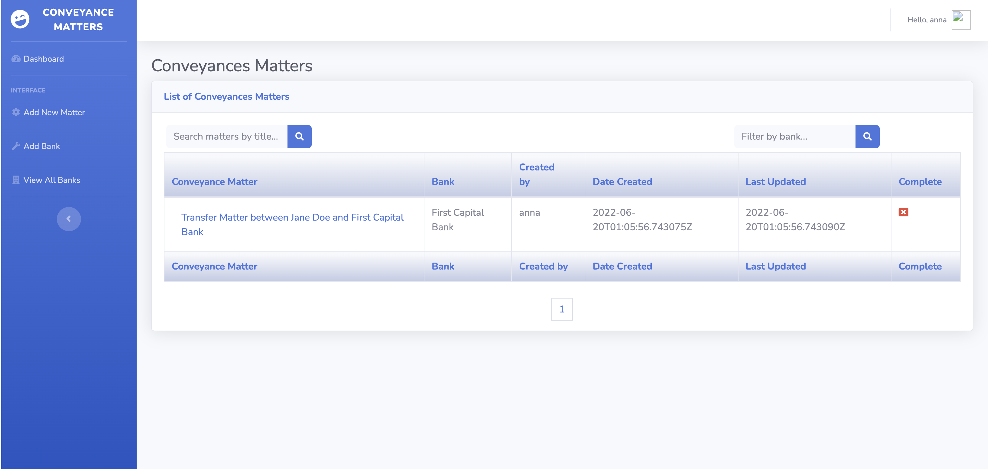

# Conveyances

This is an app for tracking conveyances matters for a legal firm. The app was developed using Django backend powered by Django Rest Framework and and a frontend powered by Vue JS. The live demo is available [here](https://conveyances.herokuapp.com/). To use the demo app, [reach out to me via email](mailto:anna@makarudze.com) and I will send you test credentials.

## Prerequisites
This app requires the following to run:
- Django 4.0+
- Python 3.9+
- Postgres 12
- Django Rest Framework
- Django Webpack Loader
- Node 16.15.0 
- npm 8.5.5
- Vue 3
- Webpack 
- Webpack Bundle Tracker
- Heroku account and CLI (for deployment)

## Installation
1. Clone the repo by running this command `git clone git@github.com:amakarudze/conveyances.git`.
2. Navigate into the project root by running this command `cd conveyances`. 
3. Create a virtualenv and activate it.
4. Install pip-tools by running `pip install pip-tools`.
5. Install requirements by running `pip install -r requirements.txt`.
6. Navigate into the `frontend` folder by running `cd frontend`.
7. Install requirements by running `npm install`.
8. To be able to have hot replacement and see changes made in Vue frontend without loading the server you need to run three console windows. Run the following commands in three separate terminals.
    - Open one terminal, navigate to the `frontend` folder and run `npx webpack --config webpack.config.js --watch`. This is for hot module replacement to watch for any changes made to the `frontend` app and load them in the Django app without refreshing or reloading the site. Django Bundle Tracker and Webpack Bundle Tracker handle this hot replacement for us.
    - Open the second terminal and navigate to the frontend folder and run `npm run serve`. This is for running the Vue app.
    - Open the third command, activate the virtualenv and run `python manage.py runserver`.  This runs the Django web server.
    - Open web browser and open `http://127.0.0.1:8000` and you will see the Django app running with the Vue frontend.

## Tests
For now the project only has backend unit tests which are run using the `coverage run -m pytest` in a terminal with the virtualenv activated.

## Deploying to live server
The app is deployed on [Heroku](https://www.heroku.com/). I usually deploy my apps to [PythonAnywhere](https://www.pythonanywhere.com/) but since I needed to use Postgres database and PythonAnywhere does not offer Postgres database for free accounts, I had to return to [Heroku](https://www.heroku.com/) after a couple of years of not using their service.

To deploy on [Heroku](https://www.heroku.com/):
- Build the frontend by running `npm run build` while in the `frontend` folder.
- Navigate to your project root folder. Follow instructions for [deploying Python project to Heroku](https://devcenter.heroku.com/articles/getting-started-with-python) up to the point of creating an app.
- Go to your Heroku dashboard and on the app's settings choose automatic [deployment from Github](https://devcenter.heroku.com/articles/github-integration). This will deploy your app from GitHub.
- Add environment variables for your app.
- If the app still doesn't run, open a console on your Heroku app and run the command `heroku ps:scale worker=1` to start a web worker as per instructions [here](https://devcenter.heroku.com/articles/procfile).

## Usage
To use the app do the following:

### On your local development server
1. Create a superuser account by running `python manage.py createsuperuser` command.
2. Spin up the Django webserver by running the `python manage.py runserver` command and visit `http://127.0.0.1:8000`. This should bring you to the login page.
3. Login with your superuser credentials and you will be able to follow through the **Using the app** section below.

### The live app
1. To test the app, reach out to [me](mailto:anna@makarudze.com) and I will email you test credentials.
2. Visit https://conveyances.herokuapp.com/ and login with the credentials provided.
3. Follow the instructions in the **Using the app** below.

After logging in, you should land at this page, which is the `Dashboard` and app home, accessed by both the `Dashboard` and `Conveyances Matter` nav brand.

### Using the app
#### Managing Banks
- **Adding a Bank** - The first step is to add banks. This can be done either through the default Django admin or in the app itself. To do this in the app UI, just click on `Add Bank` and the screen below will appear. Enter the bank name and click `Add`.

- **Filtering Banks** - Click on `View All Banks` and enter the name of bank in the `Search for bank by name` input box and either press `Enter` key or click the `search icon`.

#### Managing Conveyance Matters
- **Adding a Conveyance Matter** - Click on `Add Matter` and add the title, select bank, edit the relevant matter(s) you need to add by adding the client name  for example for a Transfer for Jane Doe say `Jane Doe - Transfer`. This is because the name field for the `Matter` model has a `unique` constraint. Also click on the select box in the row to indicate that the row should be saved as shown in the screenshot and then click the `Add` button. 

- **Updating a Conveyance Matter** - While on the list of conveyance matters, click on the title  of the matter you want to update and edit as necessary. If the stage is done/complete, make sure to select the check box to set it to true. **Note** - This process is only reversible in the admin section it was set to true by error. However you can edit the text as many times as you want. After updating the fields you wish to update, click the `Update` button to save your changes.

- **Filtering/Searching Matters** - You can filter by parts of title, say the name of the client or by the bank.
    - **Filter by name** - To filter conveyance matters by title, while on  the `Dashboard`, enter a few keywords that make up part of the title in the text input with the placeholder text `Search matter by title...`. The form submits by `Enter` keypress or clicking on the button with `search icon`.
    - **Filter by bank** - To filter conveyance matters by bank, enter the name of the bank  in the text input with the placeholder text `Filter by bank...`. The form submits by `Enter` keypresss or clicking on the button with `search icon`.

## To-do
Add `frontend` unit tests.